# 📚 Библиотека. Управление бизнес-процессами

> Веб‑приложение для автоматизации работы библиотеки: учёт книг, читателей, выдача/возврат, закупки, отчёты, управление сотрудниками (администратор и библиотекарь).

## 📸 Скриншоты

Ниже представлены все основные экраны приложения.

| 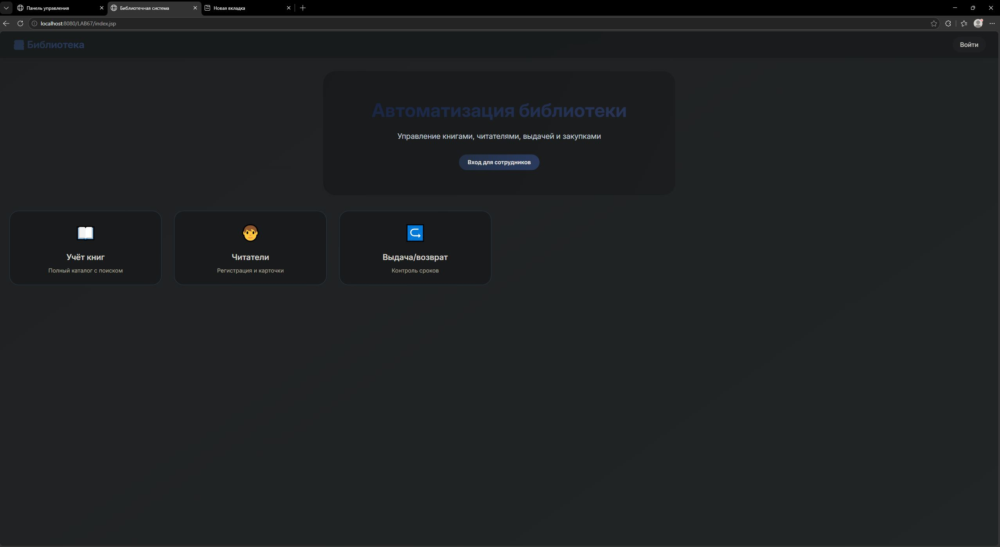 | 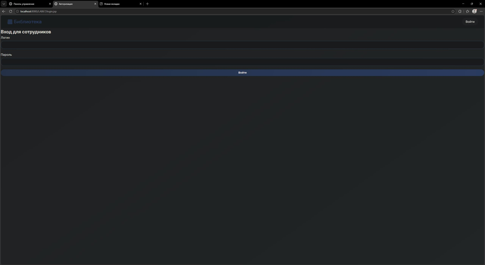 | 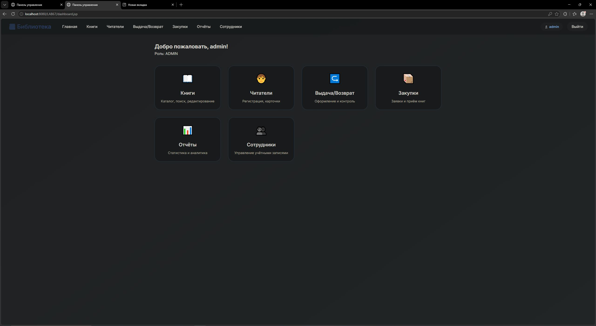 |

| 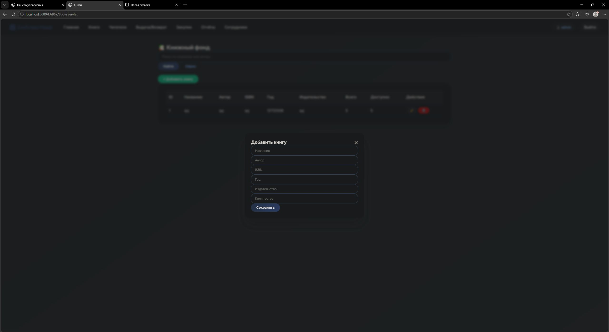 | 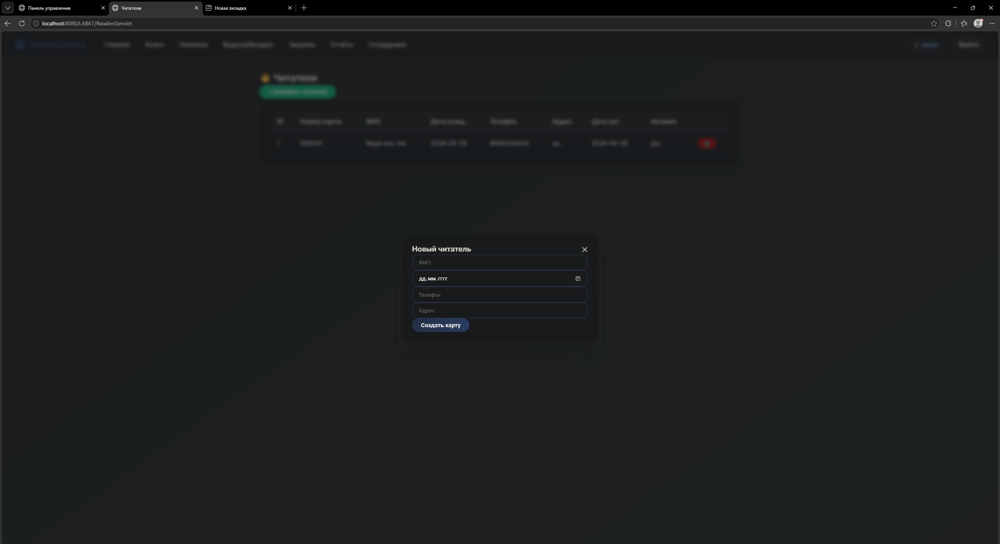 | 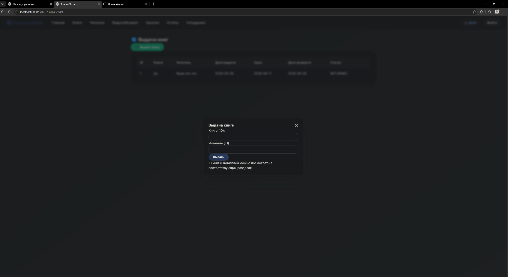 |

| 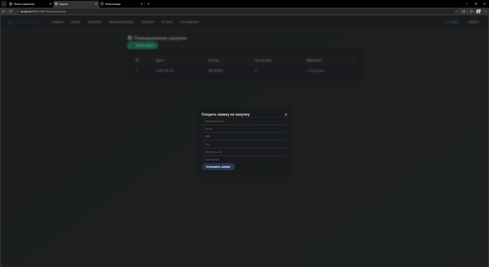 |  | 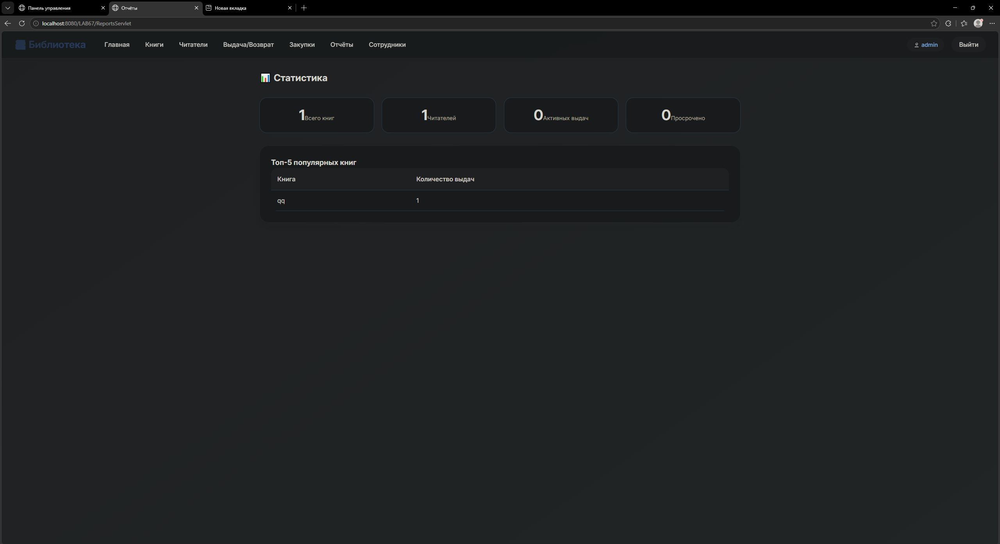 |

| 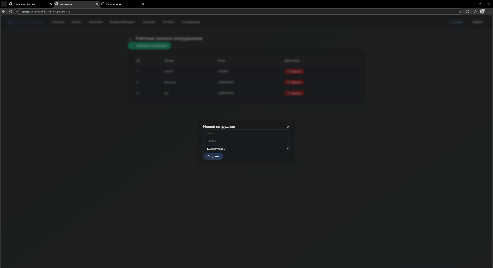 | 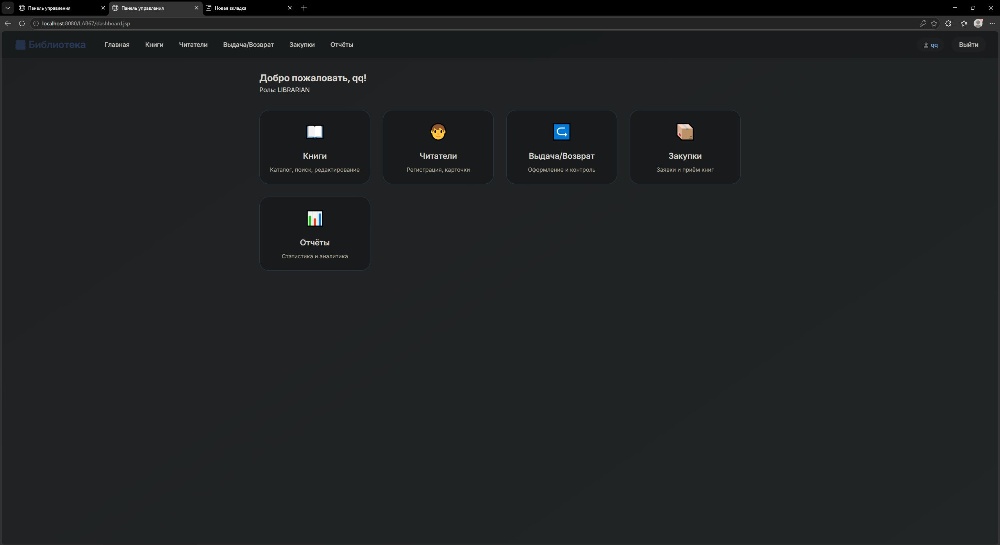 | 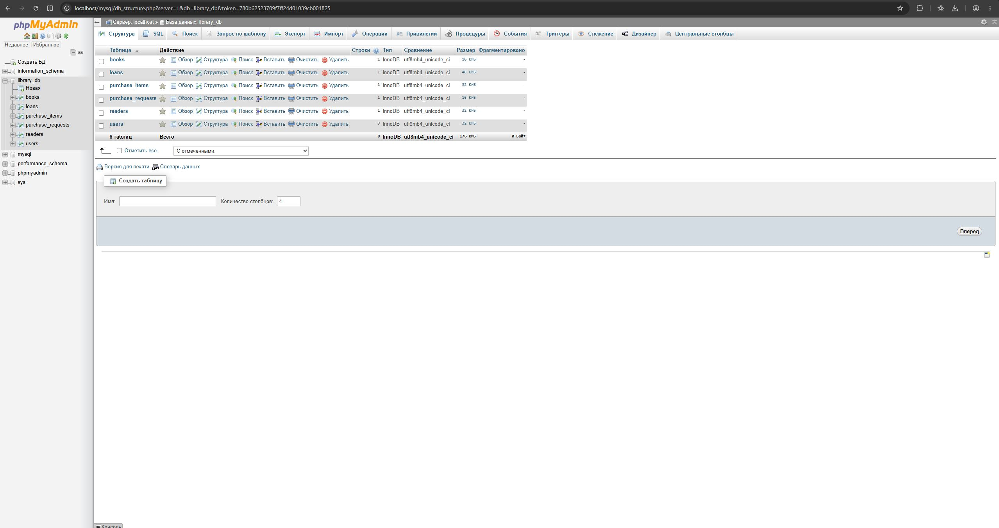 |

> *Все скриншоты находятся в папке `scr/` и имеют имена от 1.jpg до 12.jpg.*

## 👥 Роли пользователей

| Роль | Права |
|------|-------|
| **Администратор** | Полный доступ: управление книгами, читателями, выдача/возврат, закупки, отчёты, а также создание и удаление учётных записей сотрудников (библиотекарей и других администраторов). |
| **Библиотекарь** | Всё, кроме управления сотрудниками (раздел «Сотрудники» недоступен). |

> Первоначальные учётные записи создаются через SQL‑скрипт:  
> - `admin` / `admin`  
> - `librarian` / `librarian`

